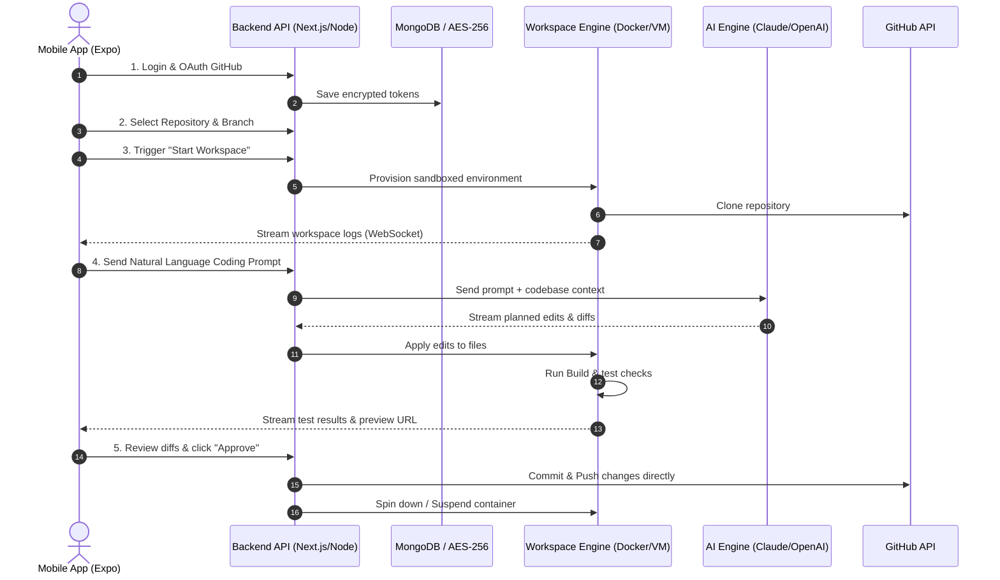

# BucketDev MVP Phase 1 & Production Roadmap Plan

This plan details the full architectural blueprint and implementation path for **BucketDev**—a mobile-first, AI-driven development agent and cloud workspace platform. 

The goal is to bridge the Gap between Phase 1 MVP (Simulated/API prototype) and a Production-grade SaaS startup. We focus on implementing the **core vertical slice** first, followed by real containerization, secure preview proxy routing, and production deployment.

---

## 🎯 The Core Vertical Slice Flow
The startup's viability depends on perfecting this single interactive flow:


---

## ⚠️ Docker Dependency Alert & Review Required

> [!WARNING]
> During a check on the environment, it was found that **Docker is not installed or not in the PATH** on this Windows host.
> This impacts **Phase 2 (Real Container Provisioning)**. Please review the options below and let us know your preference:
> 
> - **Option A: Local Node Sandbox Runner (Recommended for local dev)**: Instead of Docker, we construct an isolated sub-process environment in your local `712/scratch/workspaces` folder. The backend API clones the git repo, applies edits, and runs `npm run build` / `npm test` inside a spawned sub-process. This does not require Docker.
> - **Option B: Local Docker Workspace Setup**: You install Docker Desktop on your Windows machine, ensure it is in the PATH, and we proceed with local Docker daemon API container launching.
> - **Option C: Remote Docker Daemon / Cloud Compute**: We provision VM instances on AWS or GCP and connect to the remote Docker engine over SSH/TLS to launch containers.

---

## 🛠️ System Architecture

BucketDev is split into four distinct layers:

```
┌────────────────────────────────────────────────────────┐
│               Mobile App Client (Expo)                 │
│  - Auth (JWT)       - Repo Selector  - Live Chat/Logs  │
│  - Provider BYOK    - Code Diff View - Appr/Reject     │
└───────────────────────────┬────────────────────────────┘
                            │ (HTTPS / WebSockets)
                            ▼
┌────────────────────────────────────────────────────────┐
│                 Backend API Gateway                    │
│  - Authentication   - Key Encrypter  - Job State Mch │
│  - GitHub OAuth App - AI Stream Proxy - Webhook Handlr │
└───────────────────────────┬────────────────────────────┘
                            │ (Docker Socket / SSH / TCP)
                            ▼
┌────────────────────────────────────────────────────────┐
│               Cloud Workspace Service                  │
│  - Isolated Docker  - Port Detector  - Build Runner    │
│  - Git Handler      - Live Logger    - E-Preview Server│
└───────────────────────────┬────────────────────────────┘
                            │ (Subdomain Mapping)
                            ▼
┌────────────────────────────────────────────────────────┐
│             Preview Proxy Gateway (Nginx)              │
│  - https://<port>-<ws-id>.preview.bucketdev.com        │
│  - Dynamic routing to active container ports           │
└────────────────────────────────────────────────────────┘
```

---

## 📅 Roadmap: Milestone Breakdown

### Phase 1: Hardening the Simulated MVP (Completed)
- **`dev_` Collections Setup**: Fully operational schemas in MongoDB (`dev_users`, `dev_workspaces`, `dev_providers`, `dev_conversations`, `dev_agent_jobs`, `dev_history`).
- **Provider Key Validation**: Active validation endpoints for OpenAI and Google Gemini keys.
- **BYOK Layer**: Built AES-256-GCM data credentials protection.

### Phase 2: Sandbox Provisioning (Replacing Simulator)
Transition from simulated workspace statuses to actual execution in sandboxed environments.
- **Option A (Sub-process Sandbox)**: Use Node child processes to clone the repository into `c:/Users/Lenovo/Desktop/712/scratch/` subfolders, run builds, and stream execution logs.
- **Option B/C (Docker Container Engine)**: Build a Docker daemon interface that dynamically runs a workspace container per developer task.
- **Preconfigured Environments**: Standard setup configurations for Node/TypeScript.
- **Auto-Expiry**: Implement a cron worker that cleans up sandboxed resources after 30 minutes of inactivity.

### Phase 3: Preview Proxy Gateway
Create the routing infrastructure to allow developers to preview their changes live from their phones.
- **Port Detector**: A daemon running in the workspace that monitors standard ports to detect when a server starts listening.
- **Wildcard Subdomain DNS**: Configure Nginx/Traefik with wildcard SSL to route preview subdomains.

### Phase 4: Production Deployment & Scaling
Transition the app to cloud-scale infrastructure.
- **Database Scaling**: Migrate MongoDB to MongoDB Atlas with automated backups and replica sets.
- **Compute Provisioning**: Run the backend API on Vercel/Render, and the Workspace Engine on AWS EC2 or GCP Compute Engine instances configured with Docker.

---

## 🗄️ Database Schemas (MongoDB)

### Collection: `dev_users`
```json
{
  "_id": "ObjectId",
  "email": "user@example.com",
  "passwordHash": "bcrypt_string",
  "githubToken": "encrypted_oauth_token",
  "githubUser": {
    "login": "octocat",
    "id": 1
  },
  "createdAt": "ISODate"
}
```

### Collection: `dev_providers`
```json
{
  "_id": "ObjectId",
  "userId": "ObjectId(dev_users)",
  "provider": "openai | anthropic | gemini",
  "apiKeyEncrypted": "aes_gcm_encrypted_hex",
  "isActive": true,
  "createdAt": "ISODate"
}
```

### Collection: `dev_workspaces`
```json
{
  "_id": "ObjectId",
  "userId": "ObjectId(dev_users)",
  "repoFullName": "octocat/hello-world",
  "branch": "main",
  "status": "pending | active | stopped | expired",
  "containerId": "docker_hash",
  "ports": [3000],
  "createdAt": "ISODate",
  "updatedAt": "ISODate"
}
```

---

## 🛡️ Security & BYOK Specifications
1. **Encryption**: All API keys stored in `dev_providers` must be encrypted using `AES-256-GCM` with a rotating server-side master key (`ENCRYPTION_KEY` in env).
2. **Container Isolation**: Sandbox environments run under non-root users with strict resource quotas (CPU limits, 1GB max RAM) to prevent exhaustion of host capabilities.

---

## 🔍 Verification Plan

### Automated Verification
- Run compilation checks on the backend and mobile:
  - Mobile compilation: `npx tsc --noEmit`
  - Backend compilation: `npm run build` or `npx tsc --noEmit`
- Run DB connection integration test suites to check encryption/decryption roundtrips.

### Manual Verification
1. Register a new user on the mobile app.
2. Add a verified Anthropic/OpenAI API key.
3. Link a test GitHub repository.
4. Spin up the workspace and monitor live log streaming.
5. Submit a UI layout change prompt, review the diff, and approve the merge.
6. Verify the commit appears on GitHub and the container is cleanly torn down.
